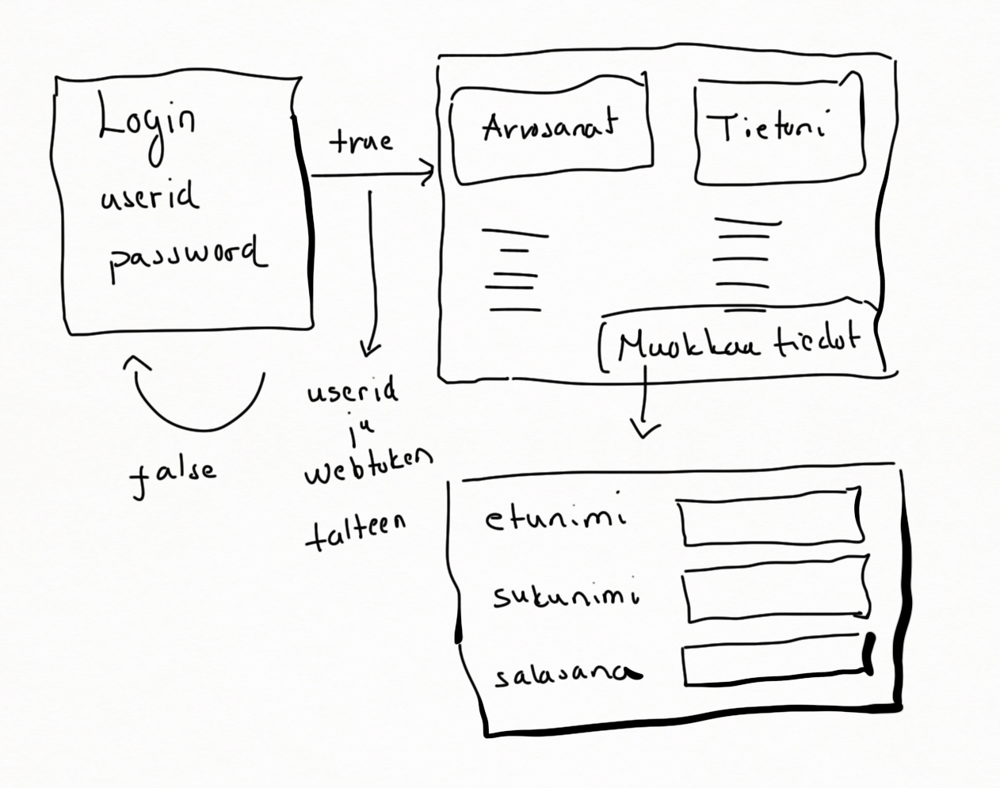
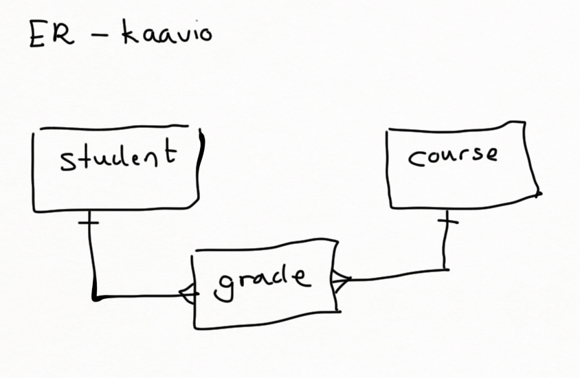
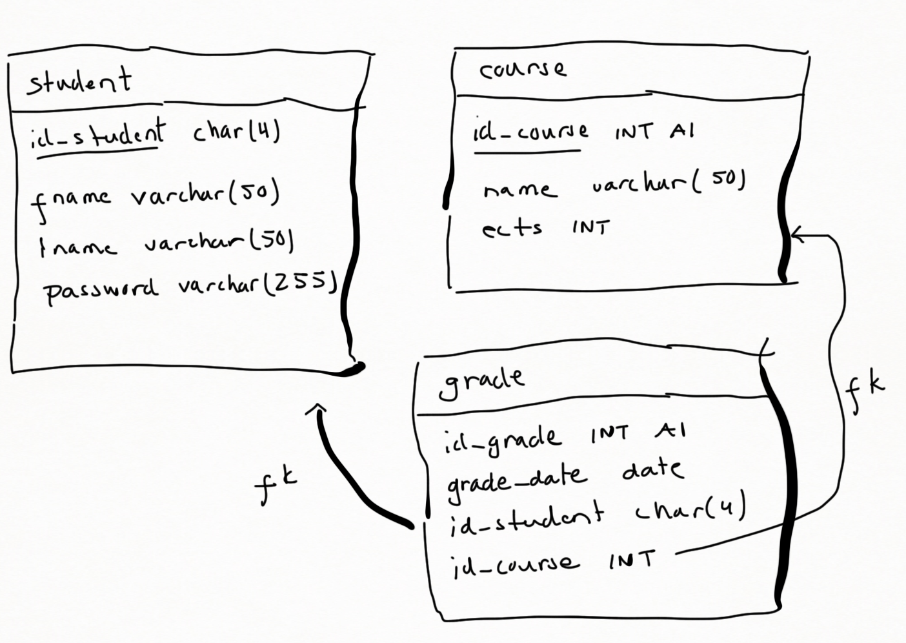
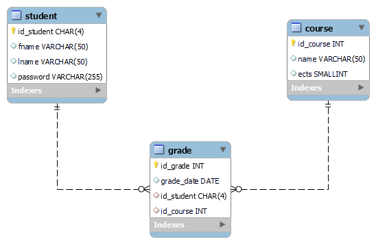

# Pankkiautomaatti projekti

## Projektin aloitus

Yksi ryhmän opiskelijoista alustaa GitHub-repositoryn seuraavasti
<ol>
    <li>Kloonaa repon omalle koneelleen jolloin hakemiston nimeksi tulee group_x, jossa x on oman ryhmän numero</li>
    <li>cd group_x</li>
    <li>git checkout -b initialize</li>
    <li>Alustaa backendin seuraavilla komennoilla
        <ul>
            <li>mkdir backend</li>
            <li>cd backend</li>
            <li>npx express-generator --no-view</li>
            <li>npm install</li>
        </ul>
    </li>
    <li>Alustaa frontendin seuraavasti 
        <ul>
            <li>Käynnistää Qt-Creatorin ja luo Qt-Widget tyyppisen sovelluksen, jonka nimesi antaa <b>frontend</b> ja tallentaa sen kansioon <b>group_x</b> </li>
            <li>Kääntää sovelluksen</li>
            <li>Tarkistaa, että frontend kansion alle ilmestyi build-kansio</li>
            <li>Jos build-kansiota ei tullut, poistaa frontend kansion ja tarkistaa Qt:n asetukset (https://peatutor.com/c_kieli/qt_asennus.php : Build kansion määrittäminen). Ja tekee uudestaan tuon sovelluksen </li>
        </ul>
    </li>
    <li>Luo <b>.gitignore</b>-tiedoston kansion group_x juureen ja kirjoittaa sinne rivit 
    <ul>
        <li>backend/node_modules/</li>
        <li>frontend/build/</li>
        <li>frontend/*.user</li>
    </ul>
    </li>
    <li>Suorittaa kansion group_x juuressa komennot 
        <ul>
            <li>git add .</li>
            <li>git commit -m "projekti alustettu"</li>
            <li>git push origin initialize</li>
        </ul>
    </li>
    <li>Tarkistaa, että GitHubiin tuli kansiot backend ja frontend ja että seuraavia ei ole GitHubissa
        <ul>
            <li>backend/node_modules</li>
            <li>frontend/build</li>
            <li>frontend/xxx.user</li>
        </ul>
    </li>
    <li>Jos edellä kaikki meni oikein, tekee PullRequestin ja pyytää jotain toista ryhmän jäsentä hyväksymään sen ja yhdistämään initialize branchin mainiin</li>
    <li>Tämän jälkeen edelliset toimenpiteet tehnyt opiskelija antaa komennot 
        <ul>
            <li>git checkout main</li>
            <li>git pull origin main</li>
        </ul>
    </li>
    <li>Tämän jälkeen kaikki muutkin ryhmän jäsenet kloonaavat repositoryn ja luovat oman branchin</li>
</ol>

## Git komentojen antaminen

Muistakaa, että git-komennot tulee antaa aina kansion group_x juuressa. Ja kansioissa backend ja frontend ei saa olla hakemistoa .git 

## Sovelluksen suunnittelu

Ennenkuin alatte koodaamaan sovellusta, kannattaa piirrellä jonkinlainen suunnitelma esimerkiksi näin:
   

Lisäksi tietokannan ER-kaavio tulee suunnitella ja sen voi aloittaa tekemällä aluksi karkean version, josta näkee yhteystyypit esimerkiksi näin:
   
Ja sitten tarkempi versio 
   
Ja lopullinen versio
    

## WebToken

Loginin siis tulee antaa onnistuneen kirjautumisen jälkeen webtoken.
Ja se toteutetaan seuraavasti. Anna backend-kansiossa komennot 
<pre>
npm install dotenv
npm install co
npm install jsonwebtoken
</pre>
Katso ohjeet sivulta https://peatutor.com/express/Examples/webtoken.php

